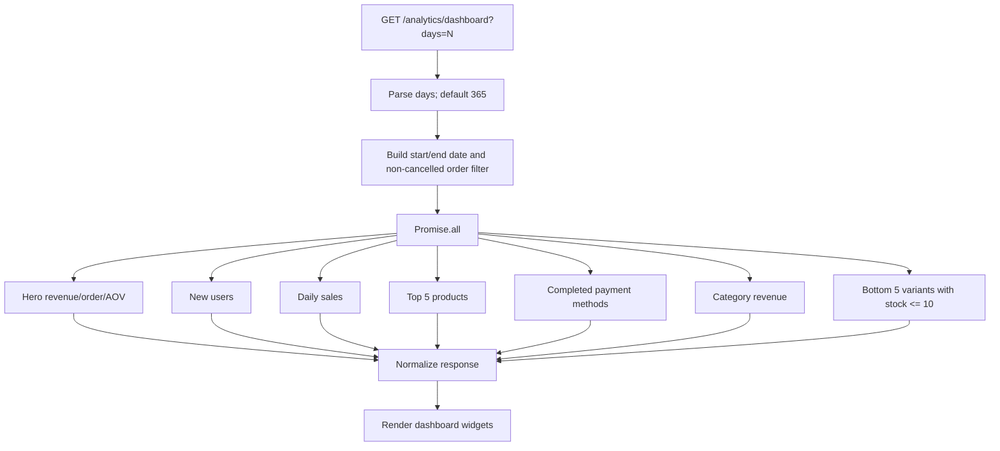

# Analytics Module Flow

```mermaid
flowchart TD
    A[GET /analytics/dashboard?days=N] --> B[Parse days; default 365]
    B --> C[Build start/end date and non-cancelled order filter]
    C --> D[Promise.all]
    D --> E[Hero revenue/order/AOV]
    D --> F[New users]
    D --> G[Daily sales]
    D --> H[Top 5 products]
    D --> I[Completed payment methods]
    D --> J[Category revenue]
    D --> K[Bottom 5 variants with stock <= 10]
    E --> L[Normalize response]
    F --> L
    G --> L
    H --> L
    I --> L
    J --> L
    K --> L
    L --> M[Render dashboard widgets]
```

🟡 Most revenue series include pending/non-cancelled orders, while the payment-method series includes only completed payments.
